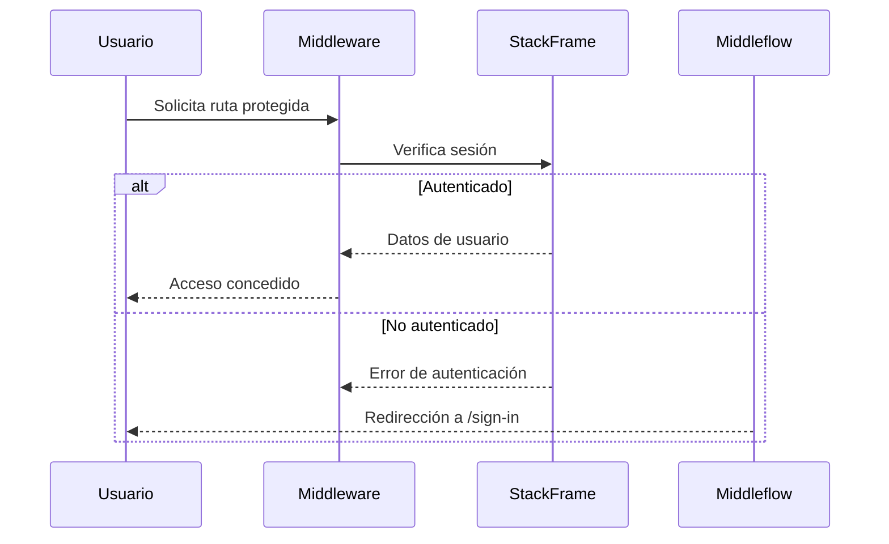

# 🚀 StackAuth - Sistema de Autenticación Moderno con Next.js 15

  
*Ejemplo de banner - Recomendamos reemplazarlo con un diseño personalizado*

Un sistema de autenticación completo construido con las últimas tecnologías web. Perfecto para proyectos que requieren seguridad robusta y experiencia de usuario moderna.

## 🌟 Características Principales
- 🔒 Autenticación segura con @stackframe/stack
- 🎨 Interfaz moderna con shadcn/ui y Tailwind CSS
- ⚡ Rendimiento optimizado con Next.js 15 (Turbopack)
- ☁️ Despliegue fácil en Cloudflare Workers
- 📱 Componentes accesibles y responsive

## 🛠 Tecnologías Utilizadas

| Tecnología         | Versión   | Propósito                          |
|--------------------|-----------|------------------------------------|
| Next.js            | 15.1.6    | Framework principal                |
| React              | 19.0.0    | Biblioteca UI                      |
| Tailwind CSS       | 3         | Estilizado                         |
| shadcn/ui          | -         | Componentes accesibles             |
| Cloudflare Workers | -         | Despliegue edge                    |
| TypeScript         | 5         | Tipado estático                    |
| StackFrame         | 2.7.8     | Sistema de autenticación           |

  
*Diagrama conceptual del flujo de autenticación*

## 📦 Requisitos Previos

- Node.js v18+
- npm v9+
- Cuenta de Cloudflare (para despliegue)
- Git (control de versiones)

## 🚀 Instalación Rápida

```bash
# 1. Clonar repositorio
git clone https://github.com/tu-usuario/stack-auth.git

# 2. Instalar dependencias
npm install

# 3. Configurar variables de entorno
cp .env.example .env.local

# 4. Iniciar servidor de desarrollo
npm run dev
```

## 🔧 Configuración Esencial

### Variables de Entorno (`/.env.local`)
```env
NEXT_PUBLIC_STACK_API_KEY=tu_clave_api
CLOUDFLARE_ACCOUNT_ID=tu_id_cuenta
CLOUDFLARE_API_TOKEN=tu_token_api
```

### Estructura de Directorios
```
├── app/
│   ├── (auth)/          # Rutas de autenticación
│   ├── handler/         # Endpoints de StackFrame
│   └── layout.tsx       # Layout principal
├── components/          # Componentes UI personalizados
├── stack.tsx            # Configuración de StackFrame
├── middleware.ts        # Lógica de protección de rutas
└── tailwind.config.js   # Configuración de Tailwind
```

## 🛡 Sistema de Autenticación

### Flujo de Trabajo


### Protección de Rutas (`/middleware.ts`)
```typescript
export const config = {
  matcher: ["/dashboard", "/settings/:path*"] // Personaliza tus rutas protegidas
};
```

## 📄 Comandos Clave

| Comando           | Descripción                              |
|-------------------|------------------------------------------|
| `npm run dev`     | Inicia servidor de desarrollo            |
| `npm run build`   | Crea versión de producción               |
| `npm run deploy`  | Despliega en Cloudflare Workers          |
| `npm run lint`    | Verifica calidad de código               |
| `npm run preview` | Previsualiza build localmente            |

## 🌈 Componentes UI con shadcn

Ejemplo de componente protegido:
```tsx
import { Button } from "@/components/ui/button"
import { useUser } from "@stackframe/stack-react"

export default function Dashboard() {
  const { user } = useUser();
  
  return (
    <div className="p-6">
      <h1 className="text-2xl font-bold mb-4">
        Bienvenido, {user?.displayName}
      </h1>
      <Button variant="outline">Acción Segura</Button>
    </div>
  )
}
```

## 🚨 Solución de Problemas Comunes

### Error: `Missing StackFrame API Key`
1. Verifica que `.env.local` exista
2. Asegúrate que las variables empiecen con `NEXT_PUBLIC_`
3. Reinicia el servidor después de cambios

### Componentes no Estilizados
```bash
# Regenerar componentes de shadcn
npx shadcn-ui@latest add [componente]
```

## 📸 Capturas de Pantalla

  
*Interfaz de inicio de sesión moderna*

  
*Panel de usuario protegido*

## 📄 Licencia
MIT License - Ver [LICENSE.md](LICENSE.md) para más detalles

---

Hecho con ❤️ por [Deus lo vult] - [Visitar Sitio Web](https://tusitio.com)
